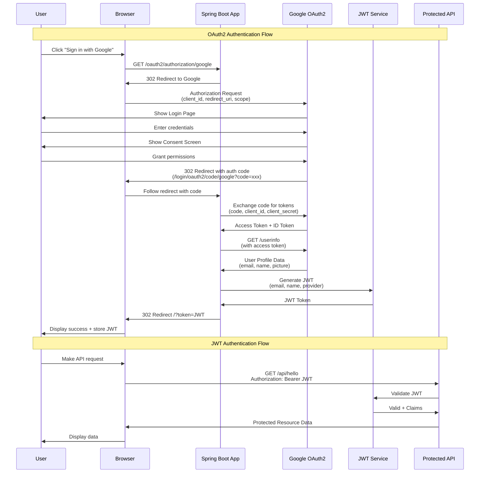
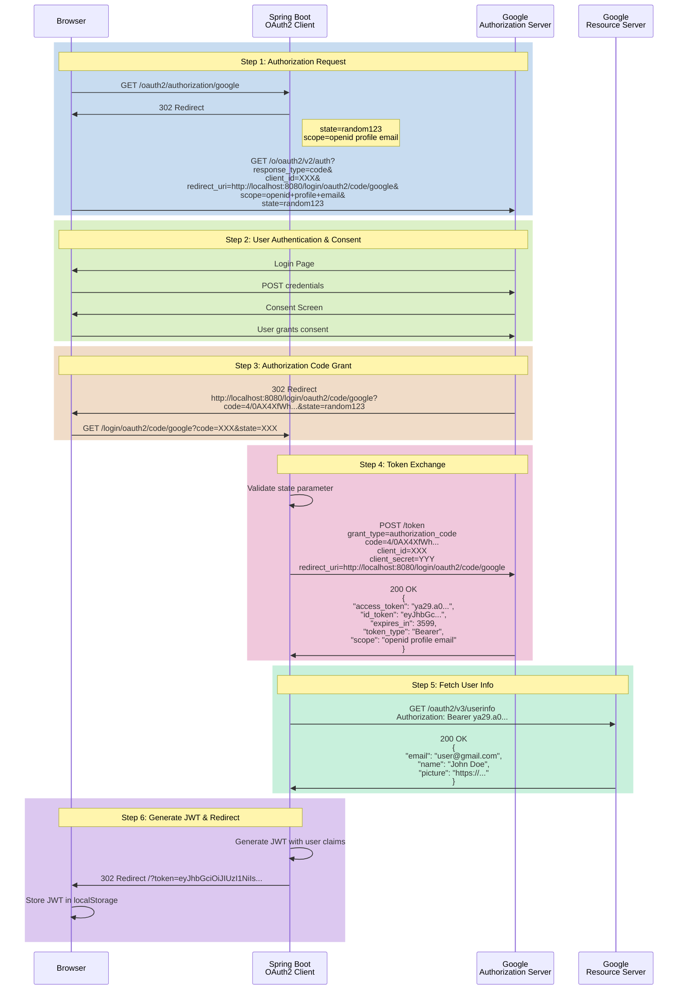
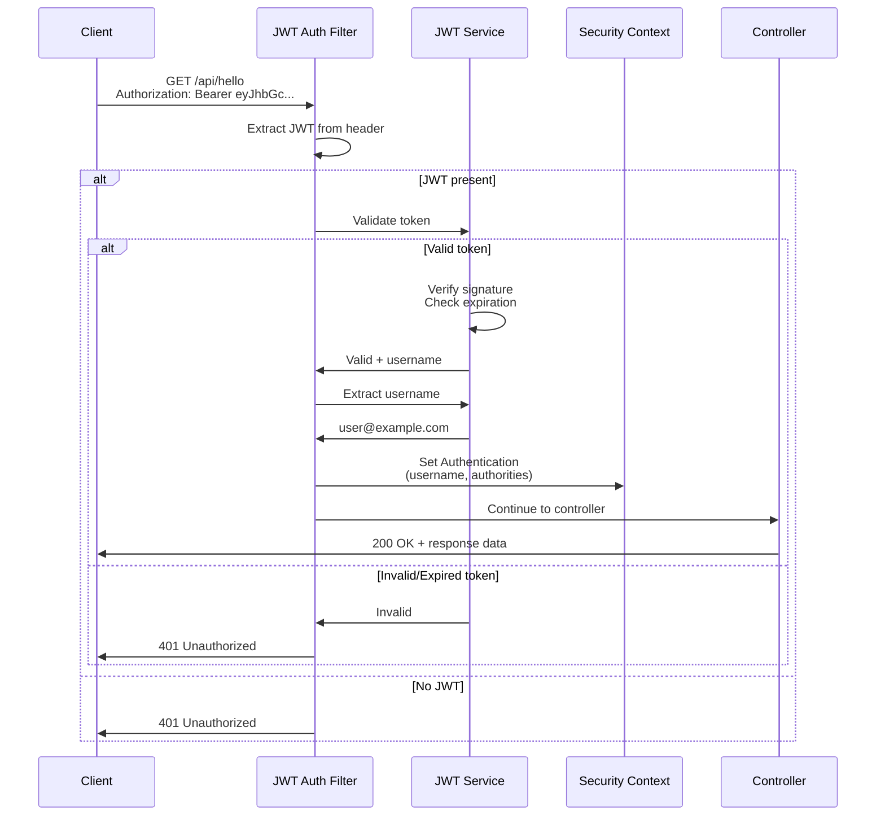
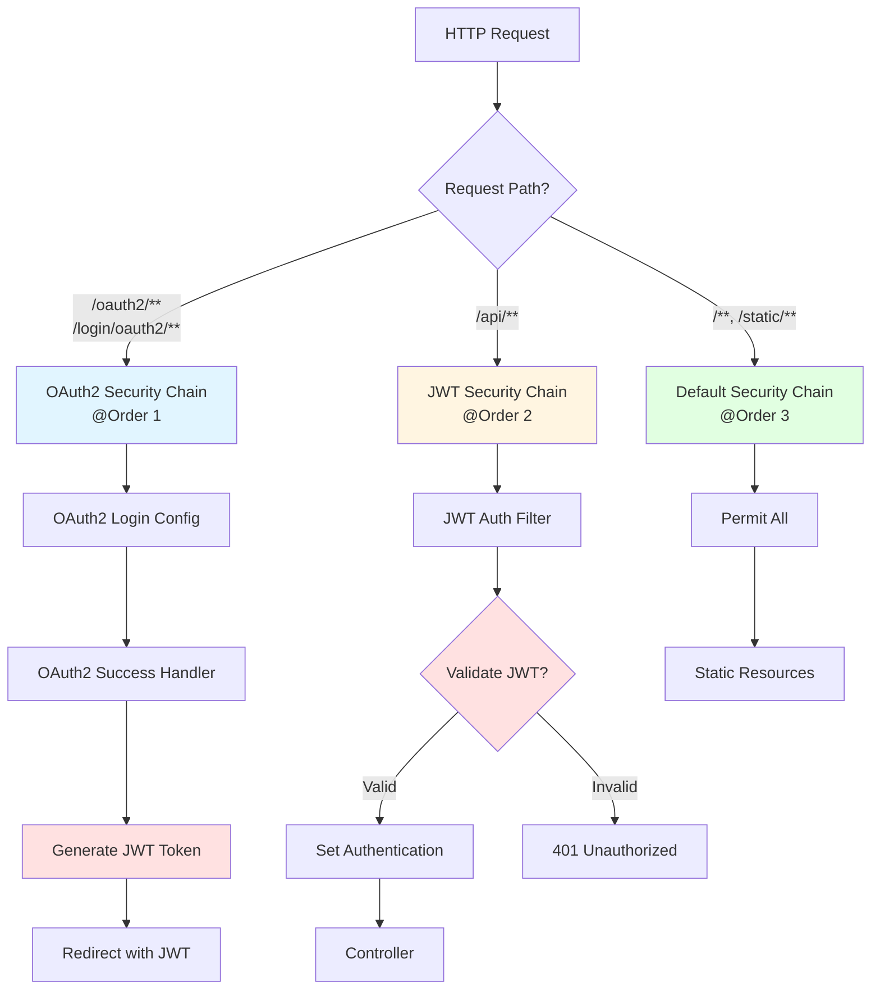
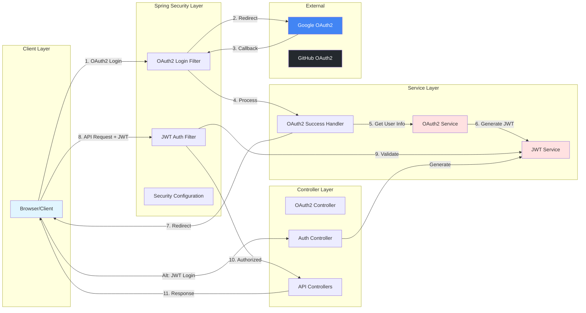
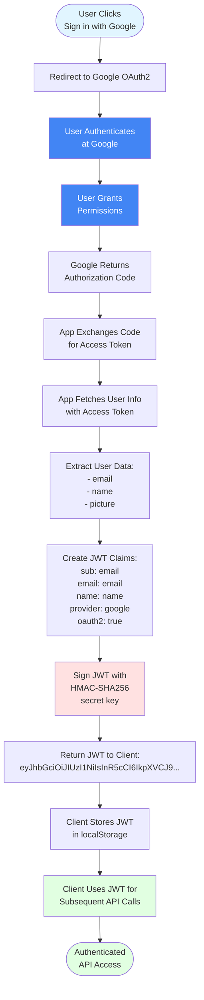

# OAuth2 + JWT Authentication Flow

## Mermaid Diagrams

### Complete OAuth2 + JWT Flow



### OAuth2 Authorization Code Flow (Detailed)



### JWT Authentication Flow



### Security Filter Chain Architecture



### Component Interaction Diagram



### Data Flow: OAuth2 to JWT Conversion



## Architecture Overview

```
┌──────────────────────────────────────────────────────────────────────┐
│                           CLIENT APPLICATION                         │
└────────────┬─────────────────────────────────────┬───────────────────┘
             │                                     │
             │ 1. Login Request                   │ 7. API Request
             │                                     │    (with JWT)
             ▼                                     ▼
┌──────────────────────────────────────────────────────────────────────┐
│                         SPRING BOOT APPLICATION                      │
│                                                                      │
│ ┌──────────────────────┐     ┌──────────────────────────────────┐  │
│ │   OAuth2 Controller   │     │      JWT Auth Filter             │  │
│ └───────────┬──────────┘     └──────────┬───────────────────────┘  │
│             │                            │                          │
│             ▼                            ▼                          │
│ ┌──────────────────────┐     ┌──────────────────────────────────┐  │
│ │   OAuth2 Service     │     │       JWT Service                │  │
│ └───────────┬──────────┘     └──────────────────────────────────┘  │
│             │                                                       │
│             │ 2. Redirect to Provider                              │
└─────────────┼───────────────────────────────────────────────────────┘
              │
              ▼
┌──────────────────────────────────────────────────────────────────────┐
│                      OAUTH2 PROVIDER (Google/GitHub)                 │
│                                                                      │
│  3. User Authentication                                              │
│  4. Authorization Grant                                              │
│  5. Redirect back with code                                         │
└──────────────────────────────────────────────────────────────────────┘
```

## Detailed Authentication Flow

### OAuth2 Login Flow

```
User                    Spring App                 OAuth2 Provider
 │                           │                           │
 │  1. Click "Login with     │                           │
 │     Google/GitHub"        │                           │
 ├──────────────────────────>│                           │
 │                           │                           │
 │                           │  2. Redirect to Provider  │
 │<──────────────────────────┤                           │
 │                           │                           │
 │  3. Authenticate          │                           │
 ├───────────────────────────┼──────────────────────────>│
 │                           │                           │
 │                           │  4. Authorization Code    │
 │<──────────────────────────┼───────────────────────────┤
 │                           │                           │
 │  5. Redirect with code    │                           │
 ├──────────────────────────>│                           │
 │                           │                           │
 │                           │  6. Exchange code         │
 │                           │     for access token      │
 │                           ├──────────────────────────>│
 │                           │                           │
 │                           │  7. Return access token   │
 │                           │<──────────────────────────┤
 │                           │                           │
 │                           │  8. Fetch user info       │
 │                           ├──────────────────────────>│
 │                           │                           │
 │                           │  9. Return user data      │
 │                           │<──────────────────────────┤
 │                           │                           │
 │                           │ 10. Generate JWT          │
 │                           │     with user claims      │
 │                           │                           │
 │  11. Return JWT token     │                           │
 │<──────────────────────────┤                           │
 │                           │                           │
```

### JWT Authentication Flow

```
User                    Spring App                 Protected Resource
 │                           │                           │
 │  1. API Request with      │                           │
 │     Bearer Token          │                           │
 ├──────────────────────────>│                           │
 │                           │                           │
 │                           │ 2. JWT Filter validates  │
 │                           │    token                 │
 │                           │                           │
 │                           │ 3. Extract claims        │
 │                           │                           │
 │                           │ 4. Set Authentication    │
 │                           │    Context              │
 │                           │                           │
 │                           │ 5. Process request      │
 │                           ├──────────────────────────>│
 │                           │                           │
 │                           │ 6. Return data          │
 │                           │<──────────────────────────┤
 │                           │                           │
 │  7. API Response          │                           │
 │<──────────────────────────┤                           │
 │                           │                           │
```

## Component Responsibilities

### OAuth2 Components

1. **OAuth2Config**: Configures OAuth2 client registrations for providers
2. **OAuth2Properties**: Manages OAuth2 configuration properties
3. **OAuth2Service**: Handles OAuth2 authentication logic and JWT generation
4. **OAuth2SuccessHandler**: Processes successful OAuth2 authentication
5. **OAuth2Controller**: Exposes OAuth2-related endpoints
6. **OAuth2SecurityConfig**: Configures security for OAuth2 endpoints

### JWT Components (Existing)

1. **JwtService**: Generates and validates JWT tokens
2. **JwtAuthFilter**: Intercepts requests to validate JWT tokens
3. **JwtProperties**: JWT configuration properties
4. **SecurityConfig**: Main security configuration

## Key Endpoints

### OAuth2 Endpoints
- `GET /oauth2/authorization/{provider}` - Initiates OAuth2 login
- `GET /login/oauth2/code/{provider}` - OAuth2 callback endpoint
- `GET /api/oauth2/user` - Get OAuth2 user information
- `POST /api/oauth2/token` - Generate JWT from OAuth2 authentication
- `POST /api/oauth2/logout` - Revoke OAuth2 session

### JWT Protected Endpoints
- `GET /api/hello` - Sample protected endpoint
- Any endpoint under `/api/**` (except `/api/auth/**`)

## Security Configuration

The implementation uses two separate security filter chains:

1. **OAuth2 Security Chain** (Order 1)
   - Handles `/oauth2/**` and `/login/oauth2/**` paths
   - Manages OAuth2 authentication flow
   - Stateless session management

2. **JWT Security Chain** (Order 2)
   - Handles `/api/**` paths
   - Validates JWT tokens for API access
   - Stateless session management

## Configuration Example

```yaml
oauth2:
  providers:
    google:
      authorization-uri: https://accounts.google.com/o/oauth2/v2/auth
      token-uri: https://oauth2.googleapis.com/token
      user-info-uri: https://www.googleapis.com/oauth2/v3/userinfo
    github:
      authorization-uri: https://github.com/login/oauth/authorize
      token-uri: https://github.com/login/oauth/access_token
      user-info-uri: https://api.github.com/user

spring:
  security:
    oauth2:
      client:
        registration:
          google:
            client-id: ${OAUTH2_GOOGLE_CLIENT_ID}
            client-secret: ${OAUTH2_GOOGLE_CLIENT_SECRET}
          github:
            client-id: ${OAUTH2_GITHUB_CLIENT_ID}
            client-secret: ${OAUTH2_GITHUB_CLIENT_SECRET}
```

## Token Structure

### JWT Token Claims
```json
{
  "sub": "user@example.com",
  "email": "user@example.com",
  "name": "User Name",
  "provider": "google",
  "oauth2": true,
  "iat": 1234567890,
  "exp": 1234571490
}
```

## Usage Example

1. **OAuth2 Login**:
```bash
# Browser navigates to:
GET http://localhost:8080/oauth2/authorization/google
```

2. **Use JWT Token**:
```bash
curl -H "Authorization: Bearer <jwt-token>" \
     http://localhost:8080/api/hello
```